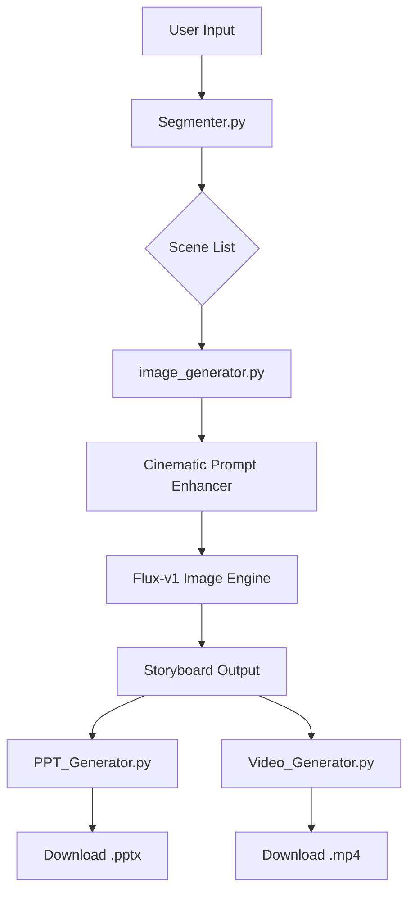

# Pitch Visualizer: From Words to Storyboard 🎬

**Turn your narrative pitch into cinematic visuals, professional pitch decks, and engaging video demos in seconds.**

[](https://fastapi.tiangolo.com/)
[](https://blackforestlabs.ai/)
[](https://www.python.org/)

---

##  Project Overview

**Pitch Visualizer** is an AI-powered creative toolkit designed for entrepreneurs, storytellers, and designers. It solves the "blank canvas" problem by instantly converting raw text narratives into high-fidelity storyboard panels. 

The core mission is to bridge the gap between an idea and its visual representation, enabling users to generate **presentation-ready assets**—including PowerPoint decks and MP4 videos—without needing complex design skills or expensive software.

### The Workflow:
1.  **Input**: Enter a narrative snippet (e.g., a startup pitch or a movie scene).
2.  **Segmenter**: AI breaks the text into distinct, meaningful scenes.
3.  **Prompt Engine**: Enhances simple sentences into rich, cinematic visual prompts.
4.  **Generation**: Flux-v1 AI engine renders photorealistic images.
5.  **Export**: Instantly download a professional **PPTX** or an **MP4** slideshow video.

---

##  Key Features

-   **Cinematic AI Generation**: Uses the cutting-edge **Flux-v1** engine for photorealistic, high-fidelity visuals.
-   **Automated Presentation Export**: One-click generation of a professional **PowerPoint (.pptx)** pitch deck.
-   **Instant Video Demos**: Native **FFmpeg** integration to create **MP4** slideshows of your storyboard.
-   **Smart Scene Segmentation**: Intelligently handles narrative flow to extract the most impactful 1–3 scenes.
-   **Interactive UX**: Real-time **countdown timer** and **progress updates** ("Generating scene X of Y").
-   **Cinematic Style Presets**: Choose between Photorealistic, Cinematic (Film Look), Cartoon, and Digital Art.
-   **Stability First**: Built with sequential processing and a 3-pass retry mechanism to ensure zero failed generations.

---

##  Tech Stack

-   **Backend**: Python, [FastAPI](https://fastapi.tiangolo.com/), [Uvicorn](https://www.uvicorn.org/)
-   **Image Engine**: [Flux](https://image.pollinations.ai/) (via Pollinations API - Zero Key Required)
-   **Frontend**: HTML5, Vanilla CSS3 (Glassmorphism), JavaScript (Async/Await)
-   **Export Tools**: [python-pptx](https://python-pptx.readthedocs.io/), [FFmpeg](https://ffmpeg.org/) (via Subprocess)

---

##  System Architecture



---

## 📁 Project Structure

| File | Description |
| :--- | :--- |
| `main.py` | The central FastAPI server handling orchestration, routing, and sequential processing. |
| `image_generator.py` | Contains the Flux-v1 integration and the Cinematic Prompt Enhancer. |
| `segmenter.py` | Logic for breaking narrative text into individual scenes using regex/NLTK. |
| `ppt_generator.py` | Generates a slide-per-scene PowerPoint deck with captions and metadata. |
| `video_generator.py` | Orchestrates FFmpeg to concatenate images into a 3s-per-frame MP4 video. |
| `templates/` | Jinja2 templates for the main dashboard and shareable storyboard view. |
| `static/` | CSS/JS assets and generated output storage. |

---

## 🚀 Installation Guide

### 1. Clone the Repository
```bash
git clone https://github.com/yourusername/pitch-visualizer.git
cd pitch-visualizer
```

### 2. Create a Virtual Environment
```bash
python -m venv venv
# Windows:
venv\Scripts\activate
# Mac/Linux:
source venv/bin/activate
```

### 3. Install Requirements
```bash
pip install -r requirements.txt
```

### 4. Install FFmpeg (Required for Video Export)
-   **Windows**: Download from [gyan.dev](https://www.gyan.dev/ffmpeg/builds/) and add its `bin` folder to your System `PATH`.
-   **Mac**: `brew install ffmpeg`
-   **Linux**: `sudo apt install ffmpeg`

### 5. Run the Server
```bash
uvicorn main:app --reload --port 8000
```
Visit `http://localhost:8000` in your browser.

---

##  Usage

1.  **Write**: Paste your pitch (e.g., *"A startup founder celebrates their first sale."*) into the text area.
2.  **Select Style**: Choose "Cinematic" or "Photorealistic" for best results.
3.  **Generate**: Click "Generate Storyboard" and watch the live countdown timer.
4.  **Review**: Expand the **"View AI Prompt"** toggle to see the technical prompts created by the engine.
5.  **Export**: Use the **📊 PPT** or **🎬 Video** buttons to download your professional assets.

---

## 🔗 API Endpoints

-   `POST /generate-storyboard`: Main engine. Takes text/style, returns images, captions, and prompts.
-   `GET /download-ppt`: Downloads the latest generated PowerPoint pitch deck.
-   `GET /download-video`: Downloads the latest generated MP4 slideshow.
-   `GET /storyboard/{session_id}`: Permanent link to view and share a specific storyboard.

---

## 🎞️ Example

**Input**: 
> "A futuristic startup office in downtown Tokyo. A team of engineers watches as their robot takes its first step. The sunset glows through the floor-to-ceiling windows, casting a golden light on their faces."

**AI-Enhanced Prompt**:
> "Photorealistic cinematic shot, 8K resolution, A futuristic startup office in downtown Tokyo, engineers watching robot, volumetric lighting, golden hour, highly detailed textures, filmmaking masterpiece."

---

## 🔮 Future Improvements

-   **Voice Narration**: Integrate Text-to-Speech (TTS) for the video export.
-   **Character Consistency**: Implement LoRA or ID-based seeds to keep the same actors across scenes.
-   **Real-time Streaming**: Switch to WebSockets for frame-by-frame progress updates.
-   **Direct Cloud Export**: Seamlessly upload to Google Drive or OneDrive.

---

## ⚠️ Troubleshooting

-   **PPTX not found**: Ensure the `python-pptx` library is installed.
-   **Video Error**: Check if `ffmpeg` is globally accessible in your terminal.
-   **Image Blur**: Try switching to the **flux** model in `image_generator.py` if Pollinations defaults are too slow.
-   **Rate Limits**: The system includes a 2s delay; if you get 429s, increase the sleep in `main.py`.

---